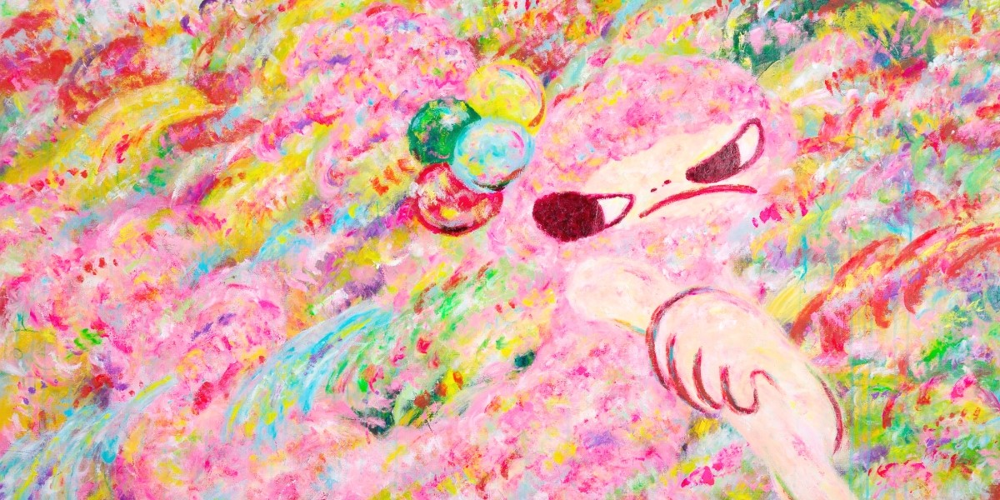

  
☆ Hi, I'm Raquel.

  
☆ I’m a Computer Science Undergraduate at PUC Minas.

  
☆ Don't hesitate to <a href="mailto:apxraquel@gmail.com" target="_blank">contact me</a> at: apxraquel@gmail.com!

  
☆ You can also find me at:

  
  

  
❀ My dream is to use programming and technology to make the world more sustainable and to favour egalitarian cultural exchange.

  
❀ Fun fact: I am fluent in Portuguese and English. I have been taking Japanese classes since july/2022.

-----

  

  

    
This is an artwork by one of my favourite artists: <a href="https://rokkakuayako.com/">ROKKAKU AYAKO</a>. I am also a big fan of YOSHITOMO NARA and AYA TAKANO.

  

          

  
˖⁺‧₊˚♡˚₊‧⁺˖♡︎˖⁺‧₊˚♡˚₊‧⁺˖<b>Raquel's Spotify Data</b>˖⁺‧₊˚♡˚₊‧⁺˖♡︎˖⁺‧₊˚♡˚₊‧⁺˖

    

-----

  
<b>Skills and languages</b>

  
☆ I’m currently learning C and C++.

<!---
raksmotta/raksmotta is a ✨ special ✨ repository because its `README.md` (this file) appears on your GitHub profile.
You can click the Preview link to take a look at your changes.
--->
